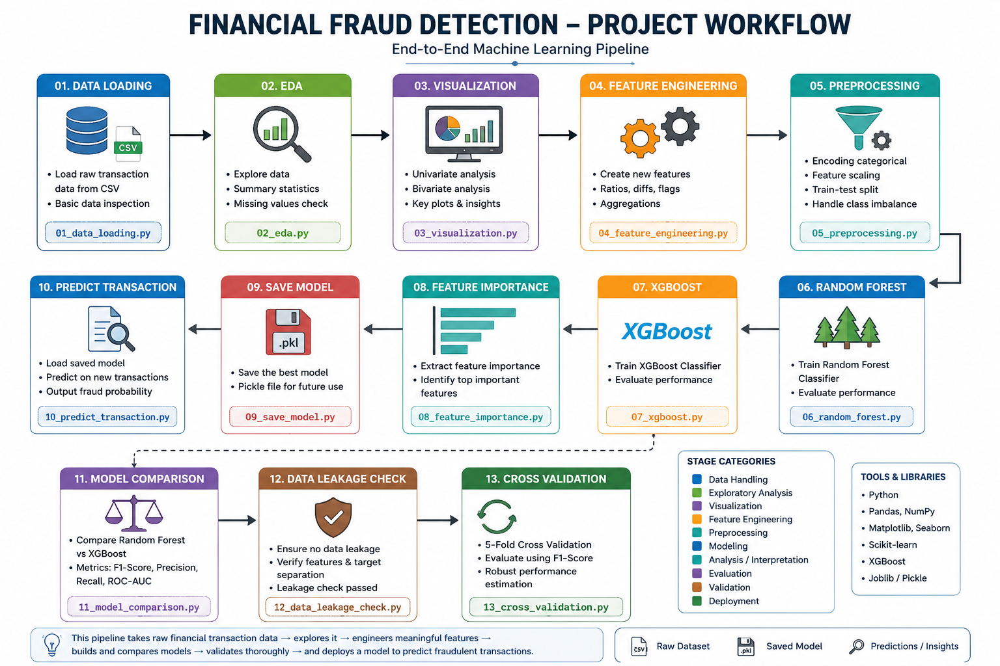
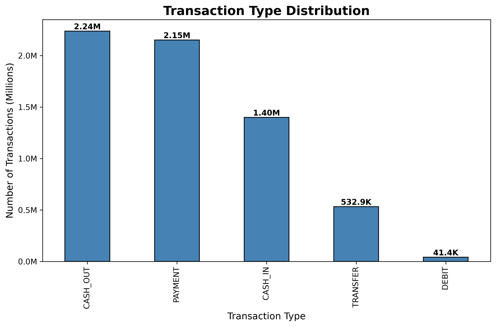
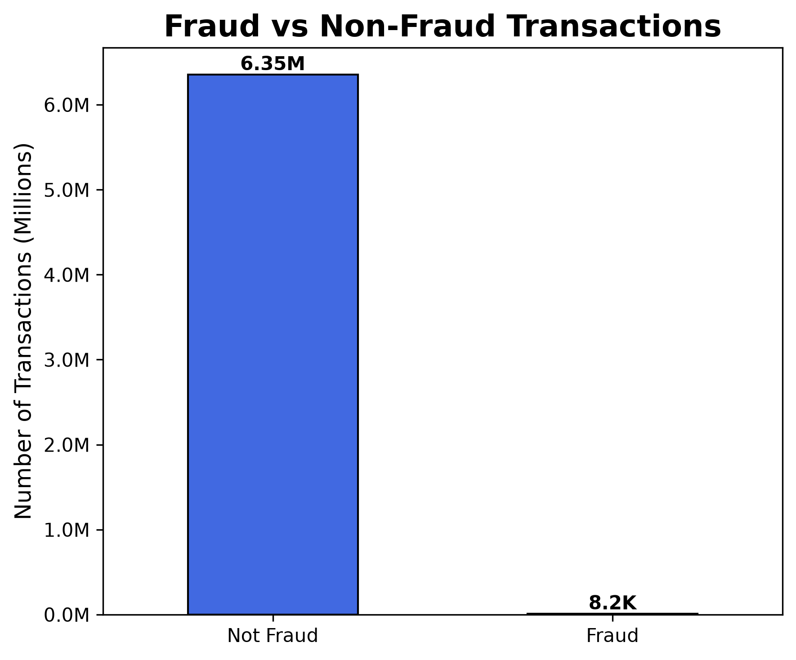
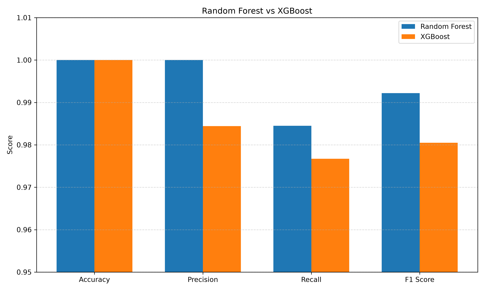
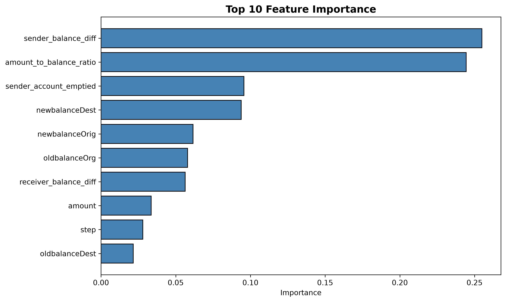

# 💳 Financial Fraud Detection using Machine Learning

An end-to-end Machine Learning project that detects fraudulent financial transactions using engineered features and supervised learning algorithms.

---

# 📌 Project Overview

Financial fraud has become one of the biggest challenges in digital banking and online transactions. This project develops an end-to-end fraud detection system capable of identifying fraudulent transactions with high accuracy using machine learning.

The project covers the complete data science pipeline including:

- Data Loading
- Exploratory Data Analysis (EDA)
- Data Visualization
- Feature Engineering
- Data Preprocessing
- Random Forest
- XGBoost
- Feature Importance Analysis
- Model Comparison
- Data Leakage Check
- Cross Validation
- Model Deployment
- Fraud Prediction

---

# 🎯 Project Objectives

- Detect fraudulent financial transactions accurately.
- Understand fraud patterns through Exploratory Data Analysis.
- Engineer meaningful features for better prediction.
- Compare multiple machine learning algorithms.
- Build a reusable fraud detection model.
- Predict fraud probability on unseen transactions.

---

# 🛠 Tech Stack

| Category | Technologies |
|-----------|--------------|
| Programming Language | Python |
| Data Analysis | Pandas, NumPy |
| Visualization | Matplotlib |
| Machine Learning | Scikit-learn, XGBoost |
| Model Saving | Joblib |
| Version Control | Git & GitHub |

---

# 🏗 Project Workflow

The project follows a complete end-to-end Machine Learning pipeline.

<p align="center">

</p>

---

# 📂 Dataset Information

Dataset Used:

**PaySim Mobile Money Financial Transactions Dataset**

### Dataset Statistics

| Metric | Value |
|--------|-------:|
| Total Transactions | 6,362,620 |
| Fraud Transactions | 8,213 |
| Legitimate Transactions | 6,354,407 |
| Fraud Rate | 0.129% |
| Original Features | 11 |
| Engineered Features | 7 |

### Target Variable

| Value | Meaning |
|-------|---------|
| 0 | Legitimate Transaction |
| 1 | Fraudulent Transaction |

---

# 📊 Exploratory Data Analysis

The following analyses were performed:

- Transaction Type Distribution
- Fraud vs Non-Fraud Distribution
- Missing Value Analysis
- Data Summary Statistics

### Transaction Type Distribution

<p align="center">

</p>

---

### Fraud Distribution

<p align="center">

</p>

---

# ⚙️ Feature Engineering

The following custom features were created to improve fraud detection performance.

| Feature | Description |
|----------|-------------|
| sender_balance_diff | Sender balance difference |
| receiver_balance_diff | Receiver balance difference |
| sender_account_emptied | Indicates if sender account became empty |
| amount_to_balance_ratio | Amount relative to sender balance |
| high_value_transaction | High-value transaction flag |
| transaction_hour | Hour extracted from transaction step |
| transaction_day | Day extracted from transaction step |

---

# 🤖 Machine Learning Models

The project compares two supervised learning algorithms.

- Random Forest Classifier
- XGBoost Classifier

Evaluation Metrics:

- Accuracy
- Precision
- Recall
- F1 Score

---

# 📈 Model Performance

| Metric | Random Forest | XGBoost |
|---------|--------------:|---------:|
| Accuracy | 1.0000 | 1.0000 |
| Precision | 1.0000 | 0.9844 |
| Recall | 0.9845 | 0.9767 |
| F1 Score | 0.9922 | 0.9805 |

---

# 📊 Model Comparison

<p align="center">

</p>

---

# 🌳 Feature Importance

Random Forest Feature Importance

<p align="center">

</p>

Top contributing features include:

- Sender Balance Difference
- Amount to Balance Ratio
- Sender Account Emptied
- New Balance Destination
- New Balance Origin

---

# 🔍 Data Leakage Check

A correlation analysis was performed to ensure that no target leakage existed in the engineered features.

This step validates that the model learns genuine fraud patterns rather than relying on leaked information.

---

# ✅ Cross Validation

5-Fold Cross Validation was performed.

Results:

- Fold 1 : 1.0000
- Fold 2 : 1.0000
- Fold 3 : 0.9630
- Fold 4 : 1.0000
- Fold 5 : 1.0000

Average F1 Score:

**0.9926**

---

# 💾 Model Deployment

The trained Random Forest model is saved using **Joblib**.

```python
joblib.dump(model, "fraud_detection_model.pkl")
```

The saved model can later be loaded for predicting new financial transactions.

---

# 🚨 Sample Prediction

Example Output

```
Prediction Result

🚨 FRAUD DETECTED

Fraud Probability : 60.13%
```

---

# 📁 Project Structure

```text
Financial_Fraud_Detection_ML
│
├── Data
│   ├── Raw
│   └── Processed
│
├── Images
│   ├── Graphs
│   ├── Workflow
│   └── Dashboards
│
├── Models
│   └── fraud_detection_model.pkl
│
├── Python
│   ├── 01_data_loading.py
│   ├── 02_eda.py
│   ├── 03_visualization.py
│   ├── 04_feature_engineering.py
│   ├── 05_preprocessing.py
│   ├── 06_random_forest.py
│   ├── 07_xgboost.py
│   ├── 08_feature_importance.py
│   ├── 09_save_model.py
│   ├── 10_predict_transaction.py
│   ├── 11_model_comparison.py
│   ├── 12_data_leakage_check.py
│   └── 13_cross_validation.py
│
├── Reports
├── SQL
├── Tableau
└── README.md
```

---

# 🚀 Future Improvements

- Deep Learning Models
- AutoML
- Explainable AI (SHAP)
- Flask/FastAPI Deployment
- Real-Time Fraud Detection API
- Streamlit Dashboard

---

# 👩‍💻 Author

**Harshita Shrotriy**

Data Analyst | Business Analyst |  Machine Learning Enthusiast

---

⭐ If you found this project useful, consider giving it a star on GitHub.